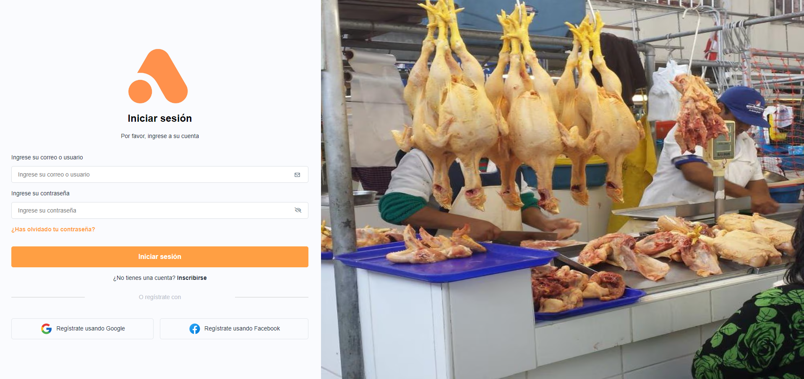
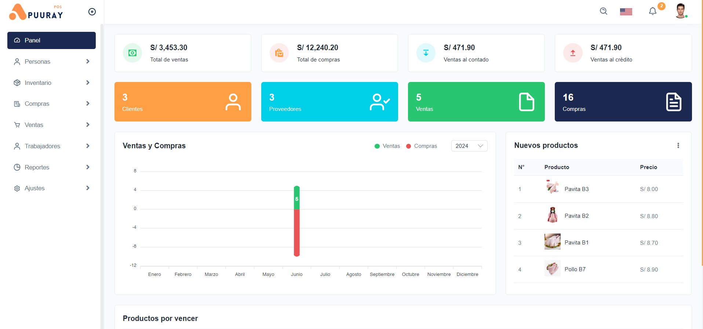
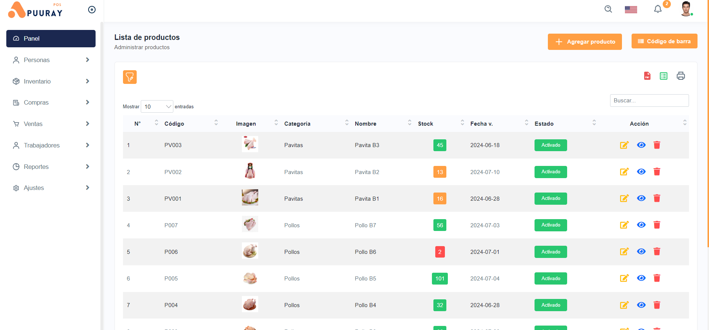
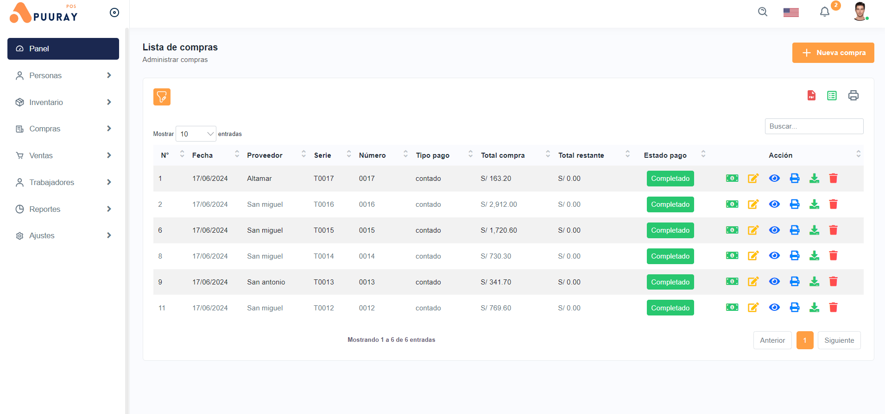
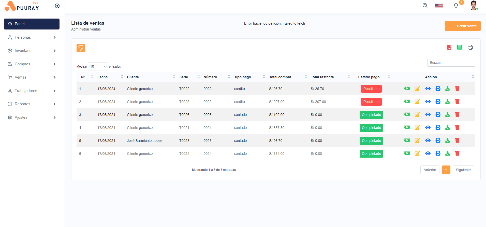
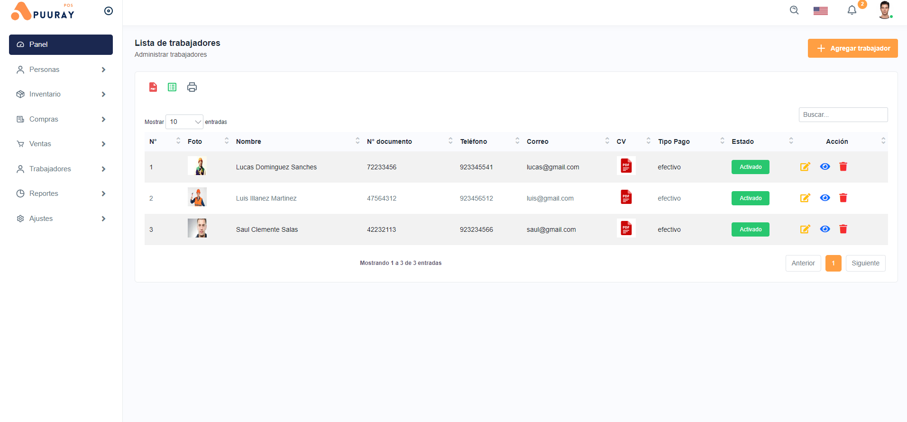
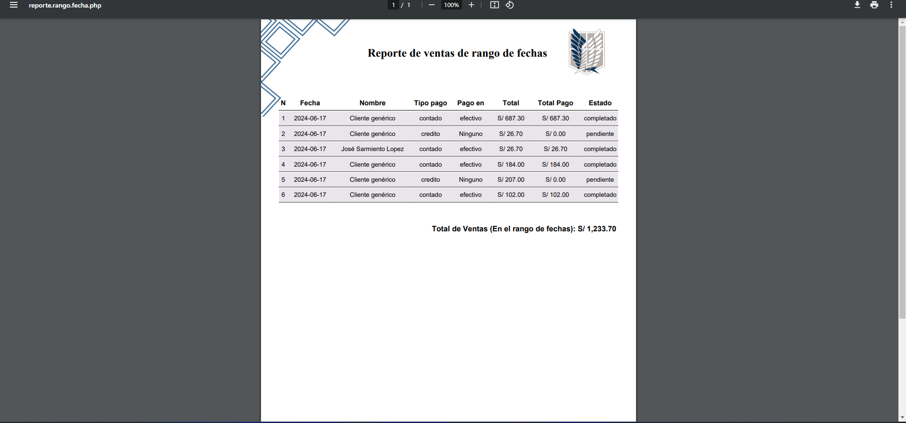
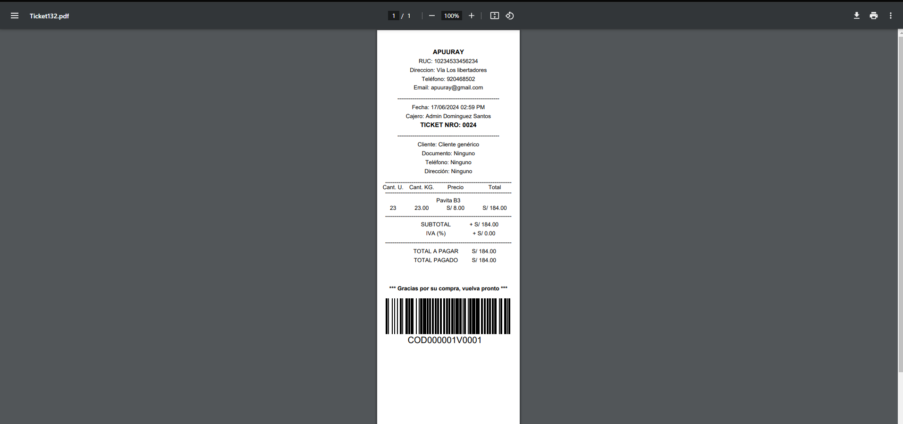
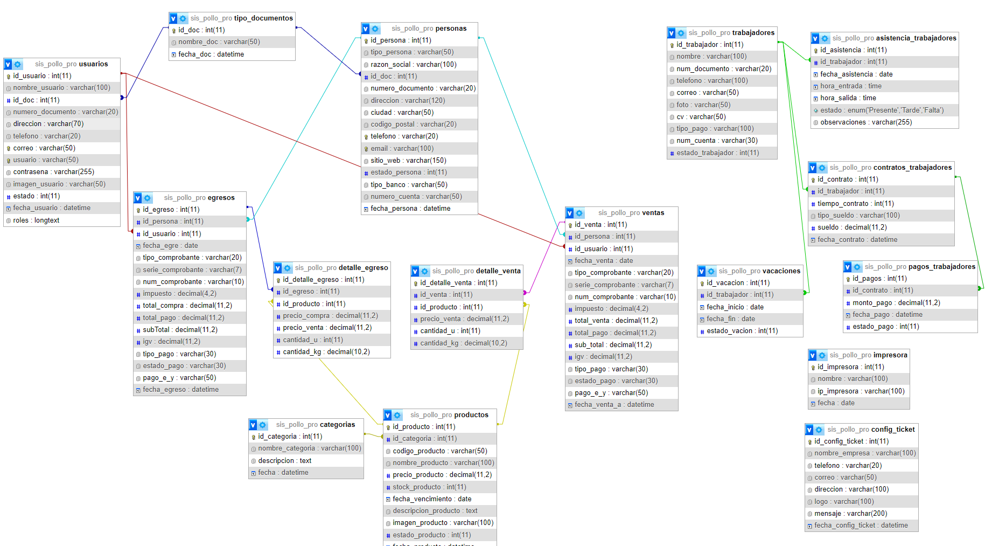

# 🐔 Sistema de Ventas de Pollos 🛒

Bienvenido al **Sistema de Ventas de Pollos** desarrollado para facilitar la gestión de negocios dedicados a la venta de pollos tanto al por mayor como al por menor.

## 🌟 Descripción

Este sistema está desarrollado utilizando las siguientes tecnologías:
- **Lenguaje de programación**: PHP
- **Base de datos**: MySQL
- **AJAX** para la comunicación asíncrona
- **Patrón MVC** (Modelo-Vista-Controlador) para una arquitectura organizada y escalable

## 🛠️ Funcionalidades

### 🔍 Panel de Control
- **Inicio**: Vista general del estado del negocio.

### 👥 Personas
- **Tipo Documento**: Gestión de tipos de documentos de identificación.
- **Usuarios**: Administración de usuarios del sistema.
- **Proveedores**: Gestión de proveedores.
- **Clientes**: Administración de la base de datos de clientes.

### 📦 Inventario
- **Categorías**: Gestión de categorías de productos.
- **Producto**: Administración de productos en inventario.
- **Imprimir Código de Barras**: Generación e impresión de códigos de barras.

### 🛒 Compras
- **Compra**: Registro y gestión de órdenes de compra.
- **Lista de Compras**: Visualización de compras registradas.

### 💰 Ventas
- **Punto de Venta**: Registro y procesamiento de ventas en tiempo real.

### 👷‍♂️ Trabajadores
- **Trabajadores**: Gestión de información de trabajadores.
- **Contrato Trabajador**: Administración de contratos de trabajadores.
- **Pago Trabajador**: Gestión de pagos a trabajadores.
- **Vacaciones**: Administración de solicitudes y aprobaciones de vacaciones.
- **Asistencia**: Registro y monitoreo de la asistencia de los trabajadores.

### 📊 Reportes
- **Usuarios**: Reportes de usuarios del sistema.
- **Proveedores**: Reportes de proveedores.
- **Clientes**: Reportes de clientes.
- **Productos**: Reportes de productos en inventario.
- **Ventas**: Reportes detallados de ventas realizadas.

### ⚙️ Ajustes (solo para administradores)
- **Configuración Ticket**: Configuración de parámetros de tickets de venta.
- **Configuración Impresora**: Gestión de la configuración de impresoras.

## 🚀 Beneficios

Implementar este sistema en tu negocio de venta de pollos te proporcionará:
- **Eficiencia**: Simplificación de procesos administrativos.
- **Control**: Mejor gestión de inventarios y ventas.
- **Análisis**: Generación de reportes detallados para la toma de decisiones.
- **Escalabilidad**: Arquitectura MVC para futuras expansiones.

## 📞 Contacto

Si estás interesado en adquirir el sistema o tienes alguna pregunta, no dudes en contactarme:
- **WhatsApp**: [Escribir](https://wa.link/e4e27c)
- **Email**: djjmygm160399@gmail.com
- **Facebook**: [Sistema de Pollos](https://facebook.com/sistemadepollos)
- **Instagram**: [@sistemadepollos](https://instagram.com/sistemadepollos)

¡Espero que este sistema pueda mejorar y optimizar tu negocio de venta de pollos! 🐔💼

---

## DEMO

- **URL**: [Sistema de Pollos](https://apuuraysis.com/)

- **Usuario**: Admin
- **Contraseña**: Admin123$

---

## 🖼️ Imágenes

### Tecnologías

### Login

### Panel de Control

### Personas

### Inventario

### Compras

### Ventas

### Trabajadores

### Reportes

### Ticket

### Base de datos

---
Desarrollado con ❤️ por Apuuray.
